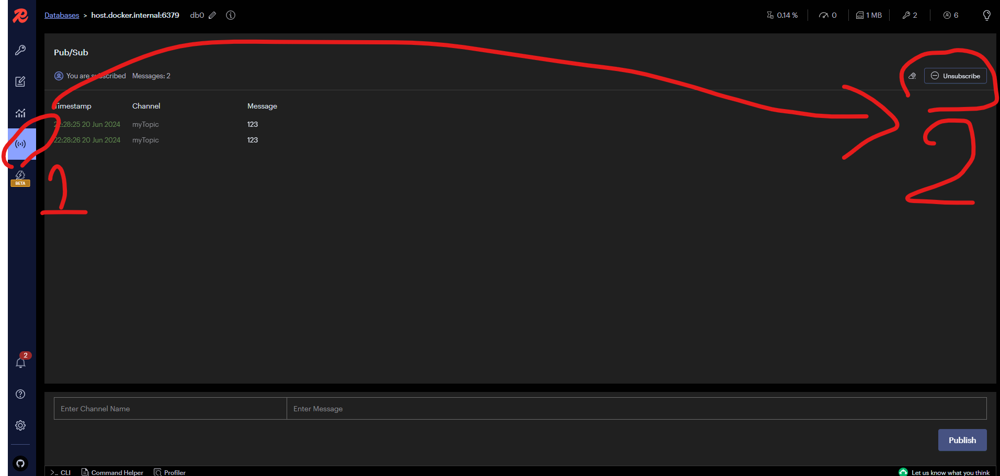
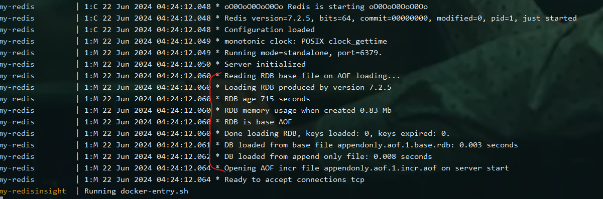
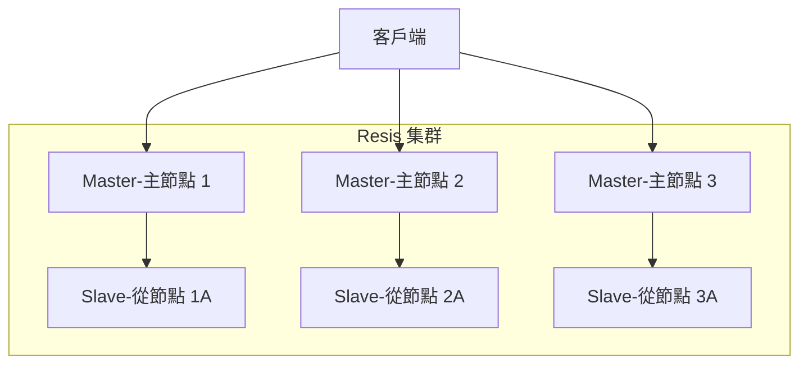
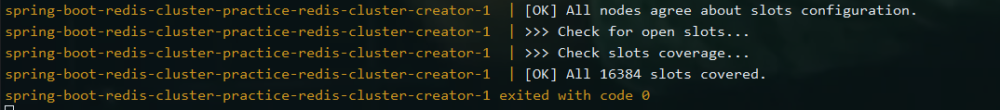

# [Redis] Redis with Spring Boot

## Redis 簡介

Redis是一種開源的，基於內存的資料結構儲存系統，也就是在RAM（隨機存取記憶體）中儲存和操作資料。RAM是一種揮發性記憶體，這意味著當電源關閉時，其中的資料會被清除。然而，由於RAM可以提供非常快速的讀寫速度，因此Redis可以提供高效能的資料存取。

這與傳統的基於磁碟的資料庫（如MySQL或PostgreSQL）有所不同，傳統的資料庫主要在磁碟上儲存資料，雖然磁碟的讀寫速度比RAM慢，但磁碟是非揮發性的，即使在電源關閉後，資料仍然可以保留。

### 資料結構

Redis支援多種資料結構，包括：

- 字串（Strings）：最基本的資料結構，可以儲存任何形式的字串，包括整數和浮點數。
- 列表（Lists）：一種有序的字串集合，可以在列表的頭部或尾部添加元素。
- 集合（Sets）：一種無序且不重複的字串集合。
- 有序集合（Sorted sets）：與集合類似，但每個元素都會關聯一個分數，Redis根據分數對元素進行排序。
- 哈希（Hashes）：一種字串對字串的映射，適合儲存物件。

然而後期也發展出了 Redis stack，也新增了一些資料結構，包括：

- 串流(Streams)：作用類似於僅附加記錄檔。串流有助於按事件發生的順序記錄事件，然後將其聯合處理。
- 地理空間索引(Geospatial)：可用於尋找特定地理半徑或邊界框內的位址。
- 位元圖(Bitmaps)：讓你可以在字串上執行位元運算。
- 位元欄位(Redis bitfields)：可以有效率地對字串值編碼多個計數器。位元欄位提供原子取得、設定和遞增運算，並支援不同的溢位政策。
- HyperLogLog：資料結構提供大型集合基數（即元素數量）的機率估計。

雖然很重要，但本篇主要會把重點放在跟 Spring Boot 整合 Redis 的部分，如果想了解更多的話可以參考[Redis英文官方文件](https://redis.io/docs/latest/develop/data-types/)，或是[Redis中文官方文件](https://redis.dev.org.tw/docs/data-types/)。

### 持久化

Redis提供了兩種持久化方法：

- RDB（Redis Database）：
    在指定的時間內，將資料集快照儲存到磁碟上。例如，可以設定每5分鐘進行一次快照儲存，將資料集儲存到磁碟上。RDB持久化是將Redis在記憶體中的資料集序列化到磁碟上的一個二進制文件中。
    - 優點：資料恢復快速。
    - 缺點：如果Redis意外關閉，可能會丟失最後一次快照之後的資料。例如，當設定為每5分鐘進行一次快照，當上一次快照結束後，又經過了4分鐘，還沒有進行下一次快照，此時Redis意外關閉，則這4分鐘內的資料將會丟失。
- AOF（Append Only File）：記錄從服務器接收到的每一條寫命令，並將這些命令記錄到磁碟上的日誌文件中。當Redis重新啟動時，可以通過重新執行這些命令來恢復資料集。
    - 優點：資料恢復更可靠。
    - 缺點：AOF日誌文件通常比RDB快照文件大，因此AOF持久化的恢復速度可能比RDB持久化慢。

### 應用場景

快取：由於Redis的高速讀寫性能，它常常被用作應用的快取層，來加速應用的響應速度。
任務隊列：Redis的列表和有序集合資料結構非常適合實現任務隊列。
發布/訂閱：Redis支援發布/訂閱模式，可以用於實現實時訊息系統。
計數器：Redis的INCR和DECR命令可以用來實現計數器功能。

## 使用 Docker 安装 Redis(單體)

Redis官方提供了一個Redis的Docker映像，可以通過Docker Hub下載。要安裝Redis，只需運行以下命令：

```bash
docker run --name my-redis -d -p 6379:6379 --name <your-redis-container-name> redis
```

- 因為我不想使用 Redis 原生的 CLI，而且 Redis 後來來有推出一個可以用來檢視 Redis 的 GUI 工具，叫做 RedisInsight，可以參考[RedisInsight](https://redis.io/docs/latest/operate/redisinsight/install/)。可以使用 Docker 安裝，非常方便。我們直接使用 Docker 安裝 RedisInsight：

```bash
docker run --name my-redis -d -p 6379:6379 --name <your-redis-container-name> redis
```

- 我把以上的 redis 和 redisinsight 用 docker compose 包起來，這樣我直接在專案目錄底下使用 `docker-compose up -d` 就可以一次啟動兩個容器了。

```yaml
version: '3.8'

services:
  redis:
    image: redis
    container_name: my-redis
    ports:
      - "6379:6379"

  redisinsight :
    image: redis/redisinsight:latest
    container_name: my-redisinsight
    ports:
      - "5540:5540"
    depends_on:
      - redis
```

- 然後我們可以透過瀏覽器，輸入 `http://localhost:5540` 來進入 RedisInsight 的介面，使用上都非常直覺，我就不介紹囉。

> 不過要注意，如果你的 Redis 是使用 Docker 安裝，且 RedisInsight 也是使用 Docker 安裝在本機上，則 RedisInsight 連接 Redis 的時候，host 要填寫 `host.docker.internal`，而不是 `localhost`。主要是因為 Docker 的網路問題，我們就不在這邊詳細說明了。有興趣的話可以參考[這篇文章](https://docs.docker.com/desktop/networking/#use-cases-and-workarounds)或是[這篇文章](https://docs.docker.com/network/)。

## Spring boot 整合 Redis

我們就不廢話，直接來囉!

- 我們的資料夾結構會如下：
```
src
├── main
│   ├── java
│   │   ├── com
│   │   │   ├── kai
│   │   │   │   ├── spring_boot_redis_practice
│   │   │   │   │   ├── config
│   │   │   │   │   │   └── SwaggerConfig.java
│   │   │   │   │   ├── MyController.java
│   │   │   │   │   └── MyService.java
│   │   │   │   └── SpringBootRedisPracticeApplication.java
│   │   └── resources
│   │       ├── application.properties
下略
```
1. 先到 [Spring Initializr](https://start.spring.io/) 創建一個新的 Spring Boot 專案，
    - Project: Maven Project
    - Language: Java
    - Spring Boot: 3.3.0
    - Packaging: Jar
    - Java: 17
    - Dependencies 選擇 `Spring Web` 、`Spring Data Redis`、`Spring Boot DevTools`、`Lombok`，然後點擊 `Generate` 下載專案。
2. 解壓縮下載的專案，然後使用 IntelliJ IDEA 或是 Eclipse 打開專案。
3. 到 `pom.xml` 檔案中加入 `swagger` 的相關依賴，方便我們測試 API。
```xml
<!--swagger-->
<dependency>
   <groupId>org.springdoc</groupId>
   <artifactId>springdoc-openapi-starter-webmvc-ui</artifactId>
   <version>2.0.2</version>
</dependency>
```
4. 建立一個 `Controller` 類別，並且加上 `@RestController` 註解，並注入 `MyService` 類別。
```java
@RestController
public class MyController {
    
        private final MyService myService;
    
        public MyController(MyService myService) {
            this.myService = myService;
        }
}
```
5. 建立一個 'MyService' 類別，並且加上 `@Service` 註解，並注入 `StringRedisTemplate` 類別。
```java
@Service
public class MyService {

    private final StringRedisTemplate stringRedisTemplate;

    public MyService(StringRedisTemplate stringRedisTemplate) {
        this.stringRedisTemplate = stringRedisTemplate;
    }
}
```
6. 開一個資料夾叫做 `config`，然後建立 `SwaggerConfig` 類別，並加上 `@Configuration` 註解。
```java
@OpenAPIDefinition(
        info = @Info(
                title = "Spring Boot integration with single node Redis practice",
                version = "0.0"
        )
)
@Configuration
public class SwaggerConfig {
}
```
7. 到 `application.properties` 檔案中加入 Redis 的連線設定。
```properties
spring.redis.host=localhost
spring.redis.port=6379
```
8. 到瀏覽器輸入 `localhost:5540` 進入前面開好的 RedisInsight，方便我們觀察 Redis 的資料。
9. 再到瀏覽器輸入 `localhost:8080/swagger-ui.html` 進入 Swagger 的介面，方便我們測試 API。

這樣所有基礎需求都寫完了，接下來我們就來實作一些 Redis 的基本操作吧~

> 為了方便，以下我們就都用 `get` Method 來操作 Redis。

## Spring Data Redis 的基本操作

### CRUD（用 Strings 舉例）

- 新增一個字串到 Redis 中。
    - Controller
    ```java
    @Operation(summary = "Save", description = "Save a key-value pair")
    @Tag(name = "Key-Value")
    @GetMapping("/save")
    public void save(@Parameter(description = "The key") String key, @Parameter(description = "The value") String value) {
        service.save(key, value);
    }
    ```
    - Service
    ```java
    public void save(String key, String value) {
        stringRedisTemplate.opsForValue().set(key, value);
    }
    ```
- 從 Redis 中取得一個字串。
    - Controller
    ```java
    @Operation(summary = "Get", description = "Gets a value by key")
    @Tag(name = "Key-Value")
    @GetMapping("/get")
    public String get(@Parameter(description = "The key") String key) {
        return service.get(key);
    }
    ```
    - Service
    ```java
    public String get(String key) {
        return stringRedisTemplate.opsForValue().get(key);
    }
    ```
- 更新 Redis 中的一個字串。其實就是新增一個字串，只是 key 已經存在。所以跟新增一個字串的方法一樣。
    - Controller
    ```java
    @Operation(summary = "Update", description = "Update a key-value pair")
    @Tag(name = "Key-Value")
    @GetMapping("/update")
    public void update(@Parameter(description = "The key") String key, @Parameter(description = "The value") String value) {
        service.update(key, value);
    }
    ```
    - Service
    ```java
    public void update(String key, String value) {
        stringRedisTemplate.opsForValue().set(key, value);
    }
    ```
- 刪除 Redis 中的一個字串。
    - Controller
    ```java
    @Operation(summary = "Delete", description = "Deletes a key-value pair")
    @Tag(name = "Key-Value")
    @GetMapping("/delete")
    public void delete(String key) {
        service.delete(key);
    }
    ```
    - Service
    ```java
    public void delete(String key) {
        stringRedisTemplate.delete(key);
    }
    ```
- 是否存在 Redis 中的一個字串。
    - Controller
    ```java
    @Operation(summary = "Exists", description = "Checks if a key exists")
    @Tag(name = "Key-Value")
    @GetMapping("/exists")
    public boolean exists(String key) {
        return service.exists(key);
    }
    ```
    - Service
    ```java
    public boolean exists(String key) {
        return Boolean.TRUE.equals(stringRedisTemplate.hasKey(key));
    }
    ```
- 儲存時，設定TTL（Time To Live），也就是 expire time。
    - Controller
    ```java
    @Operation(summary = "Get Expire", description = "Gets the expiration time of a key")
    @Tag(name = "Key-Value")
    @GetMapping("/getExpire")
    public long getExpire(String key) {
        return service.getExpire(key);
    }
    ```
    - Service
    ```java
    public void saveWithExpire(String key, String value, long seconds) {
        stringRedisTemplate.opsForValue().set(key, value, seconds, TimeUnit.SECONDS);
    }
    ```
- 取得 TTL（Time To Live）。
    - Controller
    ```java
   @Operation(summary = "Get Expire", description = "Gets the expiration time of a key")
    @Tag(name = "Key-Value")
    @GetMapping("/getExpire")
    public long getExpire(String key) {
        return service.getExpire(key);
    }
    ```
    - Service
    ```java
    public long getExpire(String key) {
        Optional<Long> duration = Optional.ofNullable(stringRedisTemplate.getExpire(key)); // 因為 getExpire() 回傳時，可能已經過期了，所以用 Optional 來處理。
        return duration.orElse(0L); // 如果 duration 是 null(已經過期所以拿不到)，則回傳 0。
    }
    ```
- 如果找不到 key，則新增一個字串到 Redis 中。如果找的到 key，則不做任何事。
    - Controller
    ```java
    @Operation(summary = "Save If Absent", description = "Save a key-value pair if the key does not exist")
    @Tag(name = "Key-Value")
    @GetMapping("/saveIfAbsent")
    public void saveIfAbsent(String key, String value) {
        service.saveIfAbsent(key, value);
    }
    ```
    - Service
    ```java
    public void saveIfAbsent(String key, String value) {
        stringRedisTemplate.opsForValue().setIfAbsent(key, value);
    }
    ```
- 計數器-增加(Increment)。
    - Controller
    ```java
    @Operation(summary = "Increment", description = "Increments a key by a delta")
    @Tag(name = "Counter")
    @GetMapping("/increment")
    public void increment(String key, long delta) {
        service.increment(key, delta);
    }
    ```
    - Service
    ```java
    public void increment(String key, long delta) {
        stringRedisTemplate.opsForValue().increment(key, delta);
    }
    ```
- 計數器-減少(Decrement)。
    - Controller
    ```java
    @Operation(summary = "Decrement", description = "Decrements a key by a delta")
    @Tag(name = "Counter")
    @GetMapping("/decrement")
    public void decrement(String key, long delta) {
        service.decrement(key, delta);
    }
    ```
    - Service
    ```java
    public void decrement(String key, long delta) {
        stringRedisTemplate.opsForValue().decrement(key, delta);
    }
    ```
- 把新的字串加到舊的字串後面，假設我原本的字串是 `Hello`，我想要加上 `World`，則結果就是 `HelloWorld`。
    - Controller
    ```java
    @Operation(summary = "Append", description = "Appends a value to a key")
    @Tag(name = "String")
    @GetMapping("/append")
    public long append(String key, String value) {
        return service.append(key, value);
    }
    ```
    - Service
    ```java
    public long append(String key, String value) {
        return stringRedisTemplate.opsForValue().append(key, value); // 可以由回傳值來得知新字串的長度。
    }
    ```
- 使用 Range 取得字串的子字串。例如，我有一個字串， key 是 `hw`，value 是 `HelloWorld`，我想要取得 `World`，則可以使用 `range("hw", 5, 10)`。
    - Controller
    ```java
    @Operation(summary = "Get Range", description = "Gets a range of values from a key")
    @Tag(name = "Other")
    @GetMapping("/getRange")
    public String getRange(String key, long start, long end) {
        return service.getRange(key, start, end);
    }
    ```
    - Service
    ```java
    public String getRange(String key, long start, long end) {
        return stringRedisTemplate.opsForValue().get(key, start, end);
    }
    ```
- 使用 Range 去取代字串中的子字串。例如，我有一個字串， key 是 `hw`，value 是 `HelloWorld`，我使用了`setRange("hw", 0, "Hi")`。則結果就是 `HilloWorld`。
    - Controller
    ```java
    @Operation(summary = "Set Range", description = "Sets a range of values to a key")
    @Tag(name = "Other")
    @GetMapping("/setRange")
    public void setRange(String key, String value, long offset) {
        service.setRange(key, value, offset);
    }
    ```
    - Service
    ```java
    public void setRange(String key, String value, long offset) {
        stringRedisTemplate.opsForValue().set(key, value, offset);
    }
    ```
- 如果我想要一次取得多個 key 的 value
    - Controller
    ```java
    @Operation(summary = "Multi Get", description = "Gets multiple values by key")
    @Tag(name = "Key-Value")
    @GetMapping("/multiGet")
    public List<String> multiGet(String key1, String key2) {
        return service.multiGet(key1, key2);
    }

    ```
    - Service
    ```java
    public List<String> multiGet(String key1, String key2) {
        List<String> keys = new ArrayList<>();
        keys.add(key1);
        keys.add(key2);
        return stringRedisTemplate.opsForValue().multiGet(keys);
    }
    ```
- 在物件導向的 Java 中，我們通常會使用物件來儲存資料，但 Redis 是一個 key-value 的資料庫，所以我們可以使用 `Hash` 來儲存物件。
    - Controller
    ```java
    @Operation(summary = "Save Hash", description = "Save a hash")
    @Tag(name = "Hash")
    @GetMapping("/saveHash")
    public void saveHash(String key, String name, String description, Integer likes, Integer visitors) {
        service.saveHash(key, name, description, likes, visitors);
    }
    ```
    - Service
    ```java
    public void saveHash(String key, String name, String description, Integer likes, Integer visitors) {
        Map<String, String> map = new HashMap<>();
        map.put("name", name);
        map.put("description", description);
        map.put("likes", likes.toString());
        map.put("visitors", visitors.toString());
        stringRedisTemplate.opsForHash().putAll(key, map);
    }
    ```
- 取得 Hash 中的所有欄位。
    - Controller
    ```java
    @Operation(summary = "Get hash", description = "Gets a hash by key")
    @Tag(name = "Hash")
    @GetMapping("/getHash")
    public Map<Object, Object> getHash(String key) {
        return service.getHash(key);
    }
    ```
    - Service
    ```java
    public Map<Object, Object> getHash(String key) {
        return stringRedisTemplate.opsForHash().entries(key);
    }
    ```
- 取得 Hash 中的某個欄位。
    - Controller
    ```java
    @Operation(summary = "Get a field value from a hash", description = "Gets a field value from a hash")
    @Tag(name = "Hash")
    @GetMapping("/getHashFieldValue")
    public String getHashFieldValue(String key, String field) {
        return service.getHashValue(key, field);
    }
    ```
    - Service
    ```java
    public String getHashValue(String key, String field) {
        return (String) stringRedisTemplate.opsForHash().get(key, field);
    }
    ```

### 列表（Lists）

- 新增一個列表到 Redis 中。如果你有一個列表想要加到現有的列表後面，也一樣使用這個方法。
    - Controller
    ```java
    @Operation(summary = "Save a list", description = "Save a list")
    @Tag(name = "List")
    @PostMapping("/saveList")
    public void saveList(String key, @RequestBody ArrayList<String> value) {
        service.saveList(key, value);
    }
    ```
    - Service
    ```java
    public void saveList(String key, ArrayList<String> values) {
        stringRedisTemplate.opsForList().rightPushAll(key, values);
    }
    ```
- 取得列表中的所有值。
    - Controller
    ```java
    @Operation(summary = "Get a list", description = "Gets a list by key")
    @Tag(name = "List")
    @GetMapping("/getList")
    public List<String> getList(String key) {
        return service.getList(key);
    }
    ```
    - Service
    ```java
    public List<String> getList(String key) {
        return stringRedisTemplate.opsForList().range(key, 0, -1);
    }
    ```
- 新增一個值到列表的尾部
    - Controller
    ```java
    @Operation(summary = "Add a value to the end of a list", description = "Add a value to the end of a list")
    @Tag(name = "List")
    @GetMapping("/addAValueToEndOfList")
    public void addAValueToEndOfList(String key, String value) {
        service.addAValueToEndOfList(key, value);
    }
    ```
    - Service
    ```java
    public void addAValueToEndOfList(String key, String value) {
        stringRedisTemplate.opsForList().rightPush(key, value);
    }
    ```
- 新增一個值到列表的頭部
    - Controller
    ```java
    @Operation(summary = "Add a value to the beginning of a list", description = "Add a value to the beginning of a list")
    @Tag(name = "List")
    @GetMapping("/addAValueToBeginningOfList")
    public void addAValueToBeginningOfList(String key, String value) {
        service.addAValueToBeginningOfList(key, value);
    }
    ```
    - Service
    ```java
    @Operation(summary = "Add a value to the beginning of a list", description = "Add a value to the beginning of a list")
    @Tag(name = "List")
    @GetMapping("/addAValueToBeginningOfList")
    public void addAValueToBeginningOfList(String key, String value) {
        service.addAValueToBeginningOfList(key, value);
    }
    ```
- 從列表的尾部 pop 取得一個值，並且於列表中移除。
    - Controller
    ```java
    @Operation(summary = "Pop a value from the end of a list", description = "Pop a value from the end of a list. After popping, the value is removed from the list.")
    @Tag(name = "List")
    @GetMapping("/popAValueFromEndOfList")
    public String popAValueFromEndOfList(String key) {
        return service.popAValueFromEndOfList(key);
    }
    ```
    - Service
    ```java
    public String popAValueFromEndOfList(String key) {
        return stringRedisTemplate.opsForList().rightPop(key);
    }
    ```
- 從列表的頭部 pop 取得一個值，並且於列表中移除。
    - Controller
    ```java
    @Operation(summary = "Pop a value from the beginning of a list", description = "Pop a value from the beginning of a list. After popping, the value is removed from the list.")
    @Tag(name = "List")
    @GetMapping("/popAValueFromBeginningOfList")
    public String popAValueFromBeginningOfList(String key) {
        return service.popAValueFromBeginningOfList(key);
    }
    ```
    - Service
    ```java
    public String popAValueFromBeginningOfList(String key) {
        return stringRedisTemplate.opsForList().leftPop(key);
    }
    ```
- 取得某個 index 的值。
    - Controller
    ```java
   @Operation(summary = "Get a value from a list by index", description = "Get a value from a list by index")
    @Tag(name = "List")
    @GetMapping("/getAValueFromListByIndex")
    public String getAValueFromListByIndex(String key, long index) {
        return service.getAValueFromListByIndex(key, index);
    }
    ```
    - Service
    ```java
    public String getAValueFromListByIndex(String key, long index) {
        return stringRedisTemplate.opsForList().index(key, index);
    }
    ```
- 以 index 從列表中移除某個值。
    - Controller
    ```java
    @Operation(summary = "Remove a value from a list by index", description = "Remove a value from a list by index")
    @Tag(name = "List")
    @GetMapping("/removeAValueFromListByIndex")
    public void removeAValueFromListByIndex(String key, long index, String value) {
        service.removeAValueFromListByIndex(key, index, value);
    }
    ```
    - Service
    ```java
    public void removeAValueFromListByIndex(String key, long index, String value) {
        stringRedisTemplate.opsForList().remove(key, index, value);
    }
    ```
- 移除列表
    - Controller
    ```java
    @Operation(summary = "Remove a list", description = "Remove a list")
    @Tag(name = "List")
    @GetMapping("/removeList")
    public void removeList(String key) {
        service.removeList(key);
    }
    ```
    - Service
    ```java
    public void removeList(String key) {
        stringRedisTemplate.delete(key);
    }
    ```

### 集合（Sets）

- 新增一個集合到 Redis 中。
    - Controller
    ```java
    @Operation(summary = "Save a set", description = "Save a set")
    @Tag(name = "Set")
    @PostMapping("/saveSet")
    public void saveSet(String key, @RequestBody ArrayList<String> value) {
        service.saveSet(key, value);
    }
    ```
    - Service
    ```java
    public void saveSet(String key, ArrayList<String> value) {
        stringRedisTemplate.opsForSet().add(key, value.toArray(new String[0]));
    }
    ```
- 取得集合中的所有值。
    - Controller
    ```java
    @Operation(summary = "Get a set", description = "Gets a set by key")
    @Tag(name = "Set")
    @GetMapping("/getSet")
    public List<String> getSet(String key) {
        return service.getSet(key);
    }
    ```
    - Service
    ```java
    public List<String> getSet(String key) {
        return new ArrayList<>(Objects.requireNonNull(stringRedisTemplate.opsForSet().members(key)));
    }
    ```
- 從集合中移除某個值。
    - Controller
    ```java
    @Operation(summary = "Remove a value from a set", description = "Remove a value from a set")
    @Tag(name = "Set")
    @GetMapping("/removeAValueFromSet")
    public void removeAValueFromSet(String key, String value) {
        service.removeAValueFromSet(key, value);
    }
    ```
    - Service
    ```java
    public void removeAValueFromSet(String key, String value) {
        stringRedisTemplate.opsForSet().remove(key, value);
    }
    ```
- 比較兩個集合的差異。
    - Controller
    ```java
   @Operation(summary = "Compare two sets and get the difference", description = "Compare two sets and get the difference")
    @Tag(name = "Set")
    @GetMapping("/difference")
    public Set<String> difference(String key1, String key2) {
        return service.difference(key1, key2);
    }
    ```
    - Service
    ```java
    public Set<String> difference(String key1, String key2) {
        return stringRedisTemplate.opsForSet().
    }
    ```
- Spring data redis 提供給 Set 的方法還有很多，例如 `union`、`intersect`、`difference`、`isMember`、`size`、`members` 等等，這邊就不一一列舉了。有用到再查就好囉!

### 有序集合（Sorted sets）- 暫時略過

### 哈希（Hashes）

- 新增一個 hash 到 Redis 中。
    - Controller
    ```java
    @Operation(summary = "Save Hash", description = "Save a hash")
    @Tag(name = "Hash")
    @GetMapping("/saveHash")
    public void saveHash(String key, String name, String description, Integer likes, Integer visitors) {
        service.saveHash(key, name, description, likes, visitors);
    }
    ```
    - Service
    ```java
    public void saveHash(String key, String name, String description, Integer likes, Integer visitors) {
        Map<String, String> map = new HashMap<>();
        map.put("name", name);
        map.put("description", description);
        map.put("likes", likes.toString());
        map.put("visitors", visitors.toString());
        stringRedisTemplate.opsForHash().putAll(key, map);
    }
    ```
- 取得 hash 中的所有欄位。
    - Controller
    ```java
    @Operation(summary = "Get hash", description = "Gets a hash by key")
    @Tag(name = "Hash")
    @GetMapping("/getHash")
    public Map<Object, Object> getHash(String key) {
        return service.getHash(key);
    }
    ```
    - Service
    ```java
    public Map<Object, Object> getHash(String key) {
        return stringRedisTemplate.opsForHash().entries(key);
    }
    ```
- 取得 hash 中的某個欄位。
    - Controller
    ```java
    @Operation(summary = "Get a field value from a hash", description = "Gets a field value from a hash")
    @Tag(name = "Hash")
    @GetMapping("/getHashFieldValue")
    public String getHashFieldValue(String key, String field) {
        return service.getHashValue(key, field);
    }
    ```
    - Service
    ```java
    public String getHashValue(String key, String field) {
        return (String) stringRedisTemplate.opsForHash().get(key, field);
    }
    ```
- 刪除 hash 中的某個欄位。
    - Controller
    ```java
    @Operation(summary = "Delete a field from a hash", description = "Delete a field from a hash")
    @Tag(name = "Hash")
    @GetMapping("/deleteHashField")
    public void deleteHashField(String key, String field) {
        service.deleteHashField(key, field);
    }
    ```
    - Service
    ```java
    public void deleteHashField(String key, String field) {
        stringRedisTemplate.opsForHash().delete(key, field);
    }
    ```
- 判斷 hash 中是否存在某個欄位。
    - Controller
    ```java
    @Operation(summary = "Exists a field in a hash", description = "Exists a field in a hash")
    @Tag(name = "Hash")
    @GetMapping("/existsHashField")
    public boolean existsHashField(String key, String field) {
        return service.existsHashField(key, field);
    }
    ```
    - Service
    ```java
    public boolean existsHashField(String key, String field) {
        return stringRedisTemplate.opsForHash().hasKey(key, field);
    }
    ```
- 刪除 hash。
    - Controller
    ```java
    @Operation(summary = "Delete a hash", description = "Delete a hash")
    @Tag(name = "Hash")
    @GetMapping("/deleteHash")
    public void deleteHash(String key) {
        service.deleteHash(key);
    }
    ```
    - Service
    ```java
    public void deleteHash(String key) {
        stringRedisTemplate.delete(key);
    }
    ```

### 串流（Streams）- 暫時略過

### 地理空間索引（Geospatial）- 暫時略過

### 位元圖（Bitmaps）- 暫時略過

### 位元欄位（Redis bitfields）- 暫時略過

### HyperLogLog- 暫時略過

## 使用 Lua 脚本執行 Redis 命令

當我們在使用 Spring boot 整合 Redis 時，有時會需要執行一些複雜的 Redis 命令操作，如果我們都使用 Spring data Redis 提供的方法，會遇到幾個問題：
- 需要多次進出 Redis，破壞了原子性。
- 需要多次網路請求，增加了網路延遲與開銷。
- 邏輯過於複雜，無法使用 Spring data Redis 提供的方法。
那麼，這時候我們可以使用 Lua 脚本來執行 Redis 命令，Lua 脚本可以保證原子性，並且可以減少網路請求。

那我們要怎麼在 Spring boot 中使用 Lua 脚本呢？我們可以使用 `StringRedisTemplate` 的 `execute` 方法來執行 Lua 脚本。

1. 先新開一個 'LuaController' 類別，並且加上 `@RestController` 註解，並注入 `LuaService` 類別。
```java
@RestController
public class LuaController {

    public final LuaService luaService;

    public LuaController(LuaService luaService) {
        this.luaService = luaService;
    }
    
}
```
2. 新開一個 'LuaService' 類別，並且加上 `@Service` 註解，並注入 `StringRedisTemplate` 類別。
```java
@Service
public class LuaService {

    private final StringRedisTemplate stringRedisTemplate;

    private final DefaultRedisScript<String> redisScript; 

    public LuaService(StringRedisTemplate stringRedisTemplate) {
        this.stringRedisTemplate = stringRedisTemplate;
        redisScript = new DefaultRedisScript<>();
    }
}
```
3. 在存放靜態資源的資料夾 `resources` 中，新增一個 Lua 脚本檔案，例如 `test.lua`。
4. 在 `test.lua` 中寫入 Lua 脚本。
```lua
-- 設置一個鍵值對
redis.call('SET', 'mykey', 'myvalue')

-- 獲取鍵的值
local value = redis.call('GET', 'mykey')

-- 返回鍵的值
return value
```
5. 在 `LuaService` 類別中新增一個方法，用來執行 Lua 脚本。
```java
    public String executeLuaScript() {
        redisScript.setScriptSource(new ResourceScriptSource(new ClassPathResource("test.lua")));
        redisScript.setResultType(String.class);
        return stringRedisTemplate.execute(redisScript, Collections.emptyList());
    }
```
6. 在 `LuaController` 類別中新增一個方法，用來執行 Lua 脚本。
```java
    @Operation(summary = "Execute Lua script", description = "Execute Lua script")
    @Tag(name = "Lua")
    @GetMapping("/executeLuaScript")
    public String executeLuaScript() {
        return luaService.executeLuaScript();
    }
```

7. 最後我們就到我們的 Swagger 介面中，測試我們的 API 吧!觸發以後就會回傳 `myvalue` 囉!
8. 也可以到我們的 RedisInsight 中，查看是否有成功設置 `mykey` 的值。

## Redis 的 Pub/Sub 模式

Redis 的 Pub/Sub 模式是一種消息傳遞模式，相較於其他的消息傳遞工具而言，是屬於輕量、簡單的存在。就我個人的經歷而言，這只能用在一些簡單且不重要的訊息傳遞上，如果是一些重要的訊息傳遞，還是建議使用功能比較完整且安全的消息傳遞工具。例如 RabbitMQ、Kafka 等等。

我在後面提供的原始碼中有實作一個簡單的 Pub/Sub 模式，我就不多做解釋了。

另外我有看到這篇文章[Redis Pub/Sub 是什麼、會造成什麼問題呢?](https://medium.com/jerrynotes/redis-pub-sub-%E6%98%AF%E4%BB%80%E9%BA%BC-%E6%9C%83%E9%80%A0%E6%88%90%E4%BB%80%E9%BA%BC%E5%95%8F%E9%A1%8C%E5%91%A2-ab5be1e5328d)，介紹 Redis 的 Pub/Sub 模式，寫得很棒~!有興趣的話可以看看。

另外在 Redisinsight 中，也有提供 Pub/Sub 的功能，可以用來觀察訊息的傳遞，不過你需要先去把它 subscribe，才能看到訊息的傳遞。否則即使你有使用 publish 來發送訊息，也是看不到的。



## 持久化

Redis 提供了兩種持久化的方式，分別是 RDB 和 AOF。
在一開始的時候我們大概介紹了，這邊我們就不多廢話了。

直接來看怎麼設定吧!

> 我們可以在 Redis 的[官方網站](https://redis.io/docs/latest/operate/oss_and_stack/management/config-file/)上找到完整個 Redis config 設定。     
> 跟大部分的 config 檔案一樣，我們只需要在 config 檔案中加入我們要的設定就好了。所以以下我們只會列出我們要的設定。

1. 先在我們的專案底下開一個資料夾叫做 `redis`，然後在裡面新增一個檔案叫做 `redis.conf`。
2. 在 `redis.conf` 中加入以下設定。
> 這裡稍微注意一下，註解如果寫在你的設定後面，例如 `save 30 1 # 這是一個註解`，可能會導致錯誤，所以建議註解寫在設定上面。
```conf
# 啟用RDB持久化
# 快照的產生會覆蓋掉原本的快照，不會造成快照的累積
# 如果至少有 1 個 key 被修改，那在 900 秒內就要進行一次快照來保存這個修改
save 30 1
# 如果至少有 10 個 key 被修改，那在 300 秒內就要進行一次快照來保存這個修改
save 20 10
# 如果至少有 10000 個 key 被修改，那在 60 秒內就要進行一次快照來保存這個修改
save 10 10000

# 啟用AOF持久化
# 每秒同步一次，其他還有always, no
appendonly yes
appendfsync everysec

# 當 AOF 文件增長為上次重寫時的 100% 時，觸發 AOF 重寫，來維持 AOF 文件的大小，使文件不會一直不斷增長
auto-aof-rewrite-percentage 100

# 當 AOF 文件當小成長到 64MB 時，觸發 AOF 重寫
auto-aof-rewrite-min-size 64mb
```
3. 接下來要去修改我們的 `docker-compose.yml` 檔案，把我們的 `redis.confg` 掛載到我們的 Redis 容器中，同時也要把我們在 Redis 容器中產生的持久化檔案(RDB 和 AOF)掛載到我們的本機中，這樣當我們的 Redis 容器被刪除時，我們的持久化檔案還是會存在。
```yml
version: '3.8'

services:
  redis:
    image: redis # 使用 Redis 官方的 image
    container_name: my-redis # 容器的名稱
    ports:
      - "6379:6379" # 將本機的 6379 port 對應到容器的 6379 port
    volumes:
      - ./redis/redis.conf:/usr/local/etc/redis/redis.conf # 將本機的 redis.conf 掛載到容器的 /usr/local/etc/redis/redis.conf
      - ./redis/redis-data:/data # 將容器的 /data 掛載到本機的 redis-data
    command: redis-server /usr/local/etc/redis/redis.conf # 啟動 Redis 時，使用我們的 redis.conf

  redisinsight:
    image: redis/redisinsight:latest
    container_name: my-redisinsight
    ports:
      - "5540:5540"
    depends_on:
      - redis
```
4. 接下來就在我們的 `docker-compose.yml` 檔案所在的資料夾中，開啟終端機，輸入以下指令，啟動我們的 Redis 容器。這裡我們不使用 `-d` 參數，我們來觀察一下 Redis 的 log。
```bash
docker-compose up 
```
    我們可以看到 Redis 的 log 中有以下訊息，啟動或讀取了我們的 RDB 及 AOF 檔案。

5. 我們也可以發現這時在我們的 `redis-data` 資料夾中，多了三個檔案。當我們的 container 被刪除又重新啟動時，就會把這三個檔案掛載到我們的 Redis 容器中，這樣就可以保證我們的 Redis 持久化檔案不會遺失。
    - appendonly.aof.1.base.rdb，這是我們的 RDB 檔案。
    - appendonly.aof.1.incr.aof，這是我們的 AOF 檔案。
    - appendonly.aof.manifest，這是我們的 AOF manifest 檔案。
6. 我們也可以使用已下指令到 redis 的容器中看看我們的持久化檔案。
```bash
docker exec -it my-redis /bin/bash
```
    進入容器後，我們可以使用 `ls` 指令看看我們的持久化檔案。
```bash
ls /data/appendonlydir
```
    我們可以看到上述的那三個檔案。
7. 接下來我們可以使用前面寫好的那些 Redis 的操作，來存入一些資料，接著把 Redis 的容器刪除，然後再重新啟動 Redis 的容器，我們就可以看到我們的資料還在。

## Redis Cluster

### Redis Cluster 的結構

Redis Cluster 是一種分散式的架構。


### 為什麼要使用 Redis Cluster

- 單節點(single node/standalone)的 Redis 當資料量過大時，容量會遇到瓶頸，也無法擴展。而 Redis Cluster 是一個分散式的 Redis，可以將資料分散到多個節點上，這樣就可以擴展 Redis 的容量。
- Redis Cluster 也提供了高可用性，當某個節點掛掉時，其他節點還是可以正常運作。
- Redis Cluster 也提供了 Load Balancing，將請求分散到多個節點上，這樣就可以減少單一節點的負載。

### Redis Cluster 是如何提供上述的功能呢?

- Redis Cluster的數據分片(data sharding)機制
    - Redis Cluster 使用 hash slot (哈希槽) 來分片數據。
    - Redis Cluster 將所有的 key 分為 16384 個 hash slot，每個 key 通過 CRC16 計算出一個 16 位的整數，然後將這個整數對 16384 取模，來決定這個 key 屬於哪個 hash slot。
    - Redis Cluster 中的每個節點會負責一部分 hash slot，例如我有三個節點，那麼它們負責的 hash slot狀況可能就如下:
        - 節點1: 0-5500
        - 節點2: 5501-11000
        - 節點3: 11001-16383
    - 我們後面整合 spring data redis 時，啟動專案就會出現像下面這樣，顯示所有的 slots 都被 cover分配好了的 log 訊息。

    - 當一個 key-value 被存入 Redis Cluster 時，Redis Cluster 會根據 key 計算出它屬於哪個 hash slot，然後將這個 key-value 存入負責這個 hash slot 的節點中。
    - 當我們要取得一個 key-value 時，Redis Cluster 會根據 key 計算出它屬於哪個 hash slot，然後去負責這個 hash slot 的節點中取得這個 key-value。
    - 自動重新分片:
        然而這些 has slot 的分配是動態的，當我們的節點出現 `新增`、`故障`、`下線` 時，Redis Cluster 會重新分配這些 hash slot。這就保證了 Redis Cluster 的高可用性。
    - Redis Cluster 是使用異步複製的方式來實現數據的同步，當一個 key-value 被存入 Redis Cluster 時，Redis Cluster 會將這個 key-value 存入主節點，然後主節點會將這個 key-value 複製到從節點中，這樣就保證了數據的一致性。但並不是強一致性。
- 自動故障轉移(Automatic Failover)：當一個主節點掛掉時，Redis Cluster 會自動選擇一個從節點升級為主節點，這樣就保證了 Redis Cluster 的高可用性。
- Gossip 協議：Redis Cluster 使用 Gossip 協議來實現節點之間的通信，保證各節點之間的狀態一致性。
- 主從架構
    - Redis Cluster 中的每個主節點(Master)可以有一個或多個從節點(Slave)。
    - 主節點(Master)負責處理讀寫請求，從節點(Slave)負責備份與故障轉移。當主節點掛掉時，Redis Cluster 會自動選擇一個從節點升級為主節點。
    - 從節點的複製是異步的，不會阻塞主節點的寫入。
    - 從節點的複製是單向的，從節點不會對主節點進行寫入。
    - 故障檢測
        - Cluster 中的節點通過 Goosip 協議來進行通信，每個節點都會定期向其他節點發送 ping 請求，如果一個主節點在一段時間內沒有收到其他節點的 pong 回應，那麼這個節點就會被標記為 "疑似下線 PFAIL"。
        - 當超過半數的主節點都認為某個疑似下線的節點是下線的時候，這個節點就會被標記為 "下線 FAIL"。
        - 當一個主節點被標記為 "下線 FAIL" 時，Redis Cluster 會把該主節點的從節點升級為主節點，這樣就保證了 Redis Cluster 的高可用性。
        - 新的主節點會接管原來主節點的 hash slot。

大概介紹到這邊就好，不然就太複雜了，我也沒完全搞懂~
如果有興趣的話，可以到 Redis 的[官方網站](https://redis.io/docs/latest/operate/oss_and_stack/management/scaling/)上看看更詳細的介紹。

### 使用 Docker 安裝 Redis Cluster

- 先開一個叫做 `.env` 的檔案，並且加入以下設定。當使用 `docker compose up` 時，Docker 會讀取這個檔案，並且將這些設定注入到我們的 `docker-compose.yml` 檔案中。這裡的 `ip` 請使用你正在使用的 網路 IPv4 位址。你可以使用 `ipconfig` 或 `ifconfig` 來查看你的 IPv4 位址。
```env
ip=<your ip>
```
- docker-compose.yml
    - `redis/redisinsight:latest`:
        - RedisInsight 是一個 Redis 的 GUI 工具，可以用來查看 Redis 的資料、設定、監控等等。
    - 為什麼除了 Redis 的 Port 外，還要多開一個加 10000 的 Port?
        - 每個 Redis Cluster 節點需要兩個開放的 TCP 連接。一個用於服務客戶端的 Redis TCP 端口，例如 7001，另一個稱為集群總線端口。默認情況下，集群總線端口是通過在數據端口上加 10000 設置的（例如 17001）。相關內容可以參考[官方文件](https://redis.io/docs/latest/operate/oss_and_stack/management/scaling/)
        - 集群總線是一個節點間的通信通道，使用二進制協議進行通信，這種協議更適合節點間的信息交換，因為它佔用的帶寬和處理時間較少。節點使用集群總線進行故障檢測、配置更新、故障轉移授權等操作。客戶端不應該嘗試與集群總線端口通信，而應使用 Redis 命令端口。然而，請確保在防火牆中開放這兩個端口，否則 Redis 集群節點之間將無法通信。
        - 為了讓 Redis Cluster 正常工作：
            - 集群總線端口必須能夠被所有其他集群節點訪問
            - 客戶端通信端口（通常為 6379），用於與客戶端通信，並且應對所有需要訪問集群的客戶端開放，以及所有使用該端口進行鍵遷移的其他集群節點開放。
    - Docker 使用 NAT(Network Address Translation) 來實現容器與外部網路的通信，因此在容器中無法直接訪問外部網路。因此，我們需要將容器的端口映射到主機的端口，這樣我們才能通過主機的端口訪問容器的端口。
    - 然而 Redis Cluster 目前並不支援 NAT，也就是無法使用 IP 地址或 TCP 端口重新映射的環境。
    - 如果要使 Docker 與 Redis Cluster 兼容，需要使用 Docker 主機網絡模式。可以參考[這裡](https://docs.docker.com/network/)。
    - `context: redis`:
        - 指定 Dockerfile 的路徑，這樣 Docker 就會到 redis 資料夾中找 Dockerfile。Dockerfile 的內容後續再提。
    - `entrypoint: [redis-server, /etc/redis/rediscluster.conf, --port,"7001", --cluster-announce-ip,"${ip}"]`:
        - 指定容器啟動時執行的命令，這裡我們使用 `redis-server` 啟動 Redis，
        - 指定配置文件為 `/etc/redis/rediscluster.conf`，並且指定端口為 7001，
        - 並且指定集群通知的 IP 為 `${ip}`。前述的 `${ip}` 是我們在 `.env` 檔案中設定的 IP。因為前面提到的 Redis Cluster 並不支援 NAT，所以我們需要指定 IP。而這裡的 IP 是使用我正在使用的 WIFI IPv4 位址。相關內容我其實也沒有完全搞懂，可以參考[官方文件](IPv4 位址)。
    - `entrypoint: [/bin/sh,-c,'echo "yes" | redis-cli -a pass.123 --cluster create ${ip}:7001 ${ip}:7002 ${ip}:7003 ${ip}:7004 ${ip}:7005 ${ip}:7006 --cluster-replicas 1']`
        - 指定容器啟動時執行的命令，這裡我們使用 `/bin/sh` 啟動 shell，
        - `-c` 參數表示後面的內容是一個命令，
        - `redis-cli` 創建 Redis Cluster
        - `${ip}:7001 ${ip}:7002 ${ip}:7003 ${ip}:7004 ${ip}:7005 ${ip}:7006` 是我們的 Redis Cluster 的節點，
        - `--cluster-replicas 1` 表示每個主節點有一個從節點。
    - `depends_on`:
        - 指定容器啟動時依賴的容器，意思是當我們的 `redis-cluster-creator` 容器啟動時，會等到 `redis-node1`、`redis-node2`、`redis-node3`、`redis-node4`、`redis-node5`、`redis-node6` 容器啟動後才會啟動。
```yml
version: '3.4'

services:
  redisinsight :
    image: redis/redisinsight:latest 
    container_name: my-redisinsight
    ports:
      - "5540:5540"
  redis-node1:
    build:
      context: redis
    ports:
      - "7001:7001" 
      - "17001:17001"
    restart: always
    entrypoint: [redis-server, /etc/redis/rediscluster.conf, --port,"7001", --cluster-announce-ip,"${ip}"]
    volumes:
      - ./logs/node1:/root/redis/log
  redis-node2:
    build:
      context: redis
    ports:
      - "7002:7002"
      - "17002:17002"
    restart: always
    entrypoint: [redis-server, /etc/redis/rediscluster.conf,--port,"7002",--cluster-announce-ip,"${ip}"]
    volumes:
      - ./logs/node2:/root/redis/log
  redis-node3:
    build:
      context: redis
    ports:
      - "7003:7003"
      - "17003:17003"
    restart: always
    entrypoint: [redis-server, /etc/redis/rediscluster.conf,--port,"7003",--cluster-announce-ip,"${ip}"]
    volumes:
      - ./logs/node3:/root/redis/log
  redis-node4:
    build:
      context: redis
    ports:
      - "7004:7004"
      - "17004:17004"
    restart: always
    entrypoint: [redis-server, /etc/redis/rediscluster.conf,--port,"7004",--cluster-announce-ip,"${ip}"]
    volumes:
      - ./logs/node4:/root/redis/log
  redis-node5:
    build:
      context: redis
    ports:
      - "7005:7005"
      - "17005:17005"
    restart: always
    entrypoint: [redis-server, /etc/redis/rediscluster.conf,--port,"7005",--cluster-announce-ip,"${ip}"]
    volumes:
      - ./logs/node5:/root/redis/log
  redis-node6:
    build:
      context: redis
    ports:
      - "7006:7006"
      - "17006:17006"
    restart: always
    entrypoint: [redis-server, /etc/redis/rediscluster.conf,--port,"7006",--cluster-announce-ip,"${ip}"]
    volumes:
      - ./logs/node6:/root/redis/log

  redis-cluster-creator:
    image: redis:6.0.3
    entrypoint: [/bin/sh,-c,'echo "yes" | redis-cli -a pass.123 --cluster create ${ip}:7001 ${ip}:7002 ${ip}:7003 ${ip}:7004 ${ip}:7005 ${ip}:7006 --cluster-replicas 1']
    depends_on:
      - redis-node1
      - redis-node2
      - redis-node3
      - redis-node4
      - redis-node5
      - redis-node6
```
- Dockerfile
    - 使用 `redis:6.0.3` 作為基礎 image。
    - 將 `rediscluster.conf` 複製到 `/etc/redis/rediscluster.conf`。
    - 使用 `redis-server /etc/redis/rediscluster.conf` 啟動 Redis Cluster。
```Dockerfile
FROM redis:6.0.3
COPY rediscluster.conf /etc/redis/rediscluster.conf
ENTRYPOINT redis-server /etc/redis/rediscluster.conf
```
- rediscluster.conf
    - `bind`:
        - 指定 Redis Cluster 的 IP。`0.0.0.0`表示所有的 IP 都可以訪問我們的 Redis Cluster。
    - `cluster-enabled yes`:
        - 啟用 Redis Cluster。
    - `cluster-config-file nodes.conf`:
        - 指定 cluster config 檔案。
    - `cluster-node-timeout 5000`:
        - 設置了節點失效的超時時間，單位是毫秒。如果一個節點在 5000 毫秒（5 秒）內沒有響應，其他節點將認為它已經失效。這個設置對於集群中的故障檢測和故障轉移非常重要。
    - `masterauth pass.123`:
        - 這個指令是用來設定從結點連接到主節點時需要提供的密碼。
    - `requirepass pass.123`:
        - 設置客戶端連接到 Redis 伺服器時需要提供的密碼。
    - `logfile "/root/redis/log/redis.log"`:
        - 指定了 Redis 的 log 檔案。
```conf
bind 0.0.0.0
cluster-enabled yes
cluster-config-file nodes.conf
cluster-node-timeout 5000
masterauth pass.123
requirepass pass.123
logfile "/root/redis/log/redis.log"
```
- 此時的資料夾結構如下:
```
.
├── .env
├── docker-compose.yml
└── redis
    ├── Dockerfile
    ├── rediscluster.conf
    └── redis-data
```
- 使用 docker-compose 啟動 Redis Cluster
```bash
docker-compose up
```
- 當你在 console 中看到以下訊息時，表示 Redis Cluster 啟動成功。
```bash
spring-boot-redis-cluster-practice-redis-cluster-creator-1  | [OK] All nodes agree about slots configuration.
spring-boot-redis-cluster-practice-redis-cluster-creator-1  | >>> Check for open slots...
spring-boot-redis-cluster-practice-redis-cluster-creator-1  | >>> Check slots coverage...
spring-boot-redis-cluster-practice-redis-cluster-creator-1  | [OK] All 16384 slots covered.
spring-boot-redis-cluster-practice-redis-cluster-creator-1 exited with code 0
```

## Spring boot 整合 Redis Cluster

- 我們的資料夾結構會如下
```
.
├── redis
│   ├── Dockerfile
│   └── rediscluster.conf
├── src
│   ├── main
│   │   ├── java
│   │   │   └── com
│   │   │       └── kai.spring_boot_redis_cluster_practice
│   │   │           ├── config
│   │   │           │   └── WriteToMasterReadFromReplicaConfig.java
|   |   |           │   └── SwaggerConfig.java
│   │   │           ├── controller
│   │   │           │   ├── MyController.java
│   │   │           │   └── TestController.java
│   │   │           ├── service
│   │   │           │   ├── MyService.java
│   │   │           │   └── TestService.java
│   │   │           └── SpringBootRedisClusterPracticeApplication.java
│   │   └── resources
│   │       ├── application.yml
│   │       ├── redis-cluster-connection-info.properties
│   │       └── static
│   └── test
├── .env
├── docker-compose.yml   
```
1. 先到 [Spring Initializr](https://start.spring.io/) 創建一個新的 Spring Boot 專案，
    - Project: Maven Project
    - Language: Java
    - Spring Boot: 3.3.0
    - Packaging: Jar
    - Java: 17
2. 加入以下的 dependencies。
    - lombok
    - devtools
    - spring-boot-starter-data-redis
    - spring-boot-starter-web
3.  另外自己加入方便測試的 swagger
```xml
<dependency>
    <groupId>org.springdoc</groupId>
    <artifactId>springdoc-openapi-starter-webmvc-ui</artifactId>
    <version>2.0.2</version>
</dependency>
```
3. spring boot 的 application.yml。 IP 就使用跟前述的 `.env` 檔案中一樣的 IP。
```yml
spring:
  application:
    name: spring-boot-redis-cluster-practice
  config:
    import: classpath:ip.properties
  data:
    redis:
      cluster:
        nodes:
          - ${ip}:7000
          - ${ip}:7001
          - ${ip}:7002
          - ${ip}:7003
          - ${ip}:7004
          - ${ip}:7005
      password: ${redis.password}
```
4. 另外開一個 `redis-cluster-connection-info.properties` 檔案，並且加入以下設定。
```properties
ip=192.168.60.62
redis.password=pass.123
```
5. SwaggerConfig.java
```java
@OpenAPIDefinition(
        info = @Info(
                title = "Spring Boot integration with Redis Cluster practice",
                version = "0.0"
        )
)
@Configuration
public class SwaggerConfig {
}
```
6. MyController.java
```java
@RestController
public class MyController {

    private final MyService service;

    public MyController(MyService service) {
        this.service = service;
    }

    @Operation(
            summary = "Hello World",
            description = "Returns a simple Hello World message"
    )
    @Tag(name = "Hello World")
    @GetMapping("/")
    public String helloWorld() {
        return "Hello World!";
    }

    @Operation(
            summary = "Save a Base-operation pair",
            description = "Save a Base-operation pair"
    )
    @Tag(name = "Base-operation")
    @GetMapping("/save")
    public void save(@Parameter(description = "The key") String key, @Parameter(description = "The value") String value) {
        service.save(key, value);
    }

    @Operation(
            summary = "Get a value by key",
            description = "Gets a value by key"
    )
    @Tag(name = "Base-operation")
    @GetMapping("/get")
    public String get(@Parameter(description = "The key") String key) {
        return service.get(key);
    }

    @Tag(name = "Base-operation")
    @Operation(
            summary = "Get all the keys and values in Redis Cluster",
            description = "Gets all the keys and values in Redis Cluster"
    )
    @GetMapping("/getAll")
    public List<String> getAll() {
        return service.getAll();
    }

    @Tag(name = "Base-operation")
    @Operation(
            summary = "Flush all the data in Redis Cluster",
            description = "Deletes all the data in Redis Cluster"
    )
    @Tag(name = "Base-operation")
    @GetMapping("/flush")
    public String flush() {
        return service.flush();
    }
}

```
7. MyService.java
```java
@Service
public class MyService {

    private static final Logger log = LoggerFactory.getLogger(MyService.class);
    private final StringRedisTemplate stringRedisTemplate;

    public MyService(StringRedisTemplate stringRedisTemplate) {
        this.stringRedisTemplate = stringRedisTemplate;
    }


    public void save(String key, String value) {

        stringRedisTemplate.opsForValue().set(key, value);

        log.info("Saved Key: {}, Value: {}", key, value);
    }

    public String get(String key) {
        String value = stringRedisTemplate.opsForValue().get(key);

        log.info("Key: {}, Value: {}", key, value);

        return value;
    }

    public String flush() {
        stringRedisTemplate.getConnectionFactory().getConnection().flushAll();
        log.info("Flushed all keys");
        return "Flushed all keys";
    }

    public List<String> getAll() {
        List<String> result = new ArrayList<>();
        stringRedisTemplate.keys("*").forEach(key -> {
            String keyWithValues = key + ": " + stringRedisTemplate.opsForValue().get(key);
            result.add(keyWithValues);
        });

        log.info("All keys and values: {}", result);

        return result;
    }
}
```
8. Redis Cluster 其實在一般的 Redis 操作上沒有太大的差異，但提供了 數據分片(Data sharding)、自動故障轉移(Automatic Failover)、高可用性(Availability)、Load Balancing 等功能。這裡我們就寫一些用來測試數據分片、自動故障轉移、高可用性的 API。程式碼我認為寫得很清楚了，所以我就不過多解釋，有興趣的到最後面把我的程式碼下載下來看看吧。
9. 新加 redis 的 WriteToMasterReadFromReplicaConfig 來設定 redis cluster 的讀寫分離
```java
@Configuration
public class WriteToMasterReadFromReplicaConfig {

    @Value("${ip}")
    private String ip;

    @Value("${redis.password}")
    private String redisPassword;

    @Bean
    public LettuceConnectionFactory redisConnectionFactory() {

        LettuceClientConfiguration clientConfig = LettuceClientConfiguration.builder()
                .readFrom(REPLICA_PREFERRED) // 設定讀寫分離
                .build();

        RedisClusterConfiguration serverConfig = new RedisClusterConfiguration();
        serverConfig.clusterNode(ip, 7001);
        serverConfig.clusterNode(ip, 7002);
        serverConfig.clusterNode(ip, 7003);
        serverConfig.clusterNode(ip, 7004);
        serverConfig.clusterNode(ip, 7005);
        serverConfig.clusterNode(ip, 7006);
        serverConfig.setPassword(redisPassword);

        return new LettuceConnectionFactory(serverConfig, clientConfig);
    }

}
```
10. TestController.java
```java
@RestController
public class TestController {

    private final TestService testService;

    public TestController(TestService testService) {
        this.testService = testService;
    }

    @Operation(
            summary = "Test sharding",
            description = """
            數據分片 (Data Sharding)
            
            Redis Cluster 使用 16384 個哈希槽來分配數據。我們可以測試數據是否確實分佈在不同的節點上。
            
            測試案例：
            
            寫入大量數據
            檢查每個節點的數據分佈
            """)
    @GetMapping("/test-sharding")
    public Map<String, Long> testSharding(@Parameter(description = "The number of keys to write") @RequestParam(defaultValue = "1000") int keyCount) {
        return testService.testSharding(keyCount);
    }
//
    @Operation(
            summary = "Test availability、Automatic Failover Step 1",
            description = """
            高可用性 (High Availability)，自動故障轉移 (Automatic Failover)

            Redis Cluster 通過主從複制確保高可用性。我們可以測試當一個主節點故障時，系統是否仍然可用。

            測試案例：

            寫入數據
            手動關閉一個主節點
            嘗試讀取數據
            """)
    @GetMapping("/test-availability")
    public String test() {
        return testService.testAvailability();
    }

    @Operation(
            summary = "Test availability、Automatic Failover Step 2",
            description = """
            手動關閉某一個主節點後，重啟一下spring boot，再次嘗試讀取數據，會發現數據依然可以讀取，且由另外一個主節點提供服務。
            至於為什麼要重啟 spring boot 才能看到效果，我不是很確定。
            可能是因為一開始連線的時候，確定好有哪些可用節點後，分配好了槽，所以即使後來有節點掛掉，他還是依照一開始的分配好的節點來回覆，
            而重啟 spring boot 可能是重新連線，重新分配槽，所以才能看到效果。但實際上就算你不重啟還是可以取得資料，只是他仍然顯示資料是從舊的節點取回。
            測試完畢後，如果你想要重新啟動節點，請把剛剛關掉的節點啟動，然後再重新跑一次 redis-cluster-creator container。
            """)
    @GetMapping("/test-availability-2")
    public String testAvailability2() {
        return testService.testAvailability2();
    }

    @Operation(
            summary = "Test read/write splitting",
            description = """
            讀寫分離 (Read/Write Splitting)

            Redis Cluster 支持從主節點寫入數據，從從節點讀取數據，這可以提高讀取性能。

            測試案例：
            一次寫操作和多次讀操作，並記錄每次操作使用的節點。
            獲取當前操作使用的 Redis 節點的信息，包括節點 ID 和角色（主節點或副本節點）。
            """)
    @GetMapping("/test-read-write-splitting")
    public Map<String, String> testReadWriteSplitting(@RequestParam String key, @RequestParam String value, @RequestParam(defaultValue = "10") int readCount) {
//        TODO
        return null;
    }
}
```
11. TestService.java
```java
@Service
public class TestService {

    private static final Logger logger = LoggerFactory.getLogger(TestService.class);
    private final StringRedisTemplate redisTemplate;

    public TestService(StringRedisTemplate redisTemplate) {
        this.redisTemplate = redisTemplate;
    }

    public Map<String, Long> testSharding(Integer keyCount) {

        for (int i = 0; i < keyCount; i++) {
            redisTemplate.opsForValue().set("key" + i, "value" + i);
        }

        Map<String, Long> nodePortAndKeyCounts = new HashMap<>();
        for (int i = 0; i < 1000; i++) {
            String key = "key" + i;
            RedisClusterConnection clusterConnection = redisTemplate.getConnectionFactory().getClusterConnection();
            int slot = clusterConnection.clusterGetSlotForKey(key.getBytes()); // Redis cluster 會根據 key 的哈希值來分配槽
            String nodePort = String.valueOf(clusterConnection.clusterGetNodeForSlot(slot).getPort()); // 根據槽來獲取節點
            nodePortAndKeyCounts.put(nodePort, nodePortAndKeyCounts.getOrDefault(nodePort, 0L) + 1);
        }

        logger.info("""
                Node ports and their key counts:
                {}
                """, nodePortAndKeyCounts);

        return nodePortAndKeyCounts;

    }

    public String testAvailability() {

//    1. 先寫入一筆數據
        String key = "availabilityKey";
        String value = "availabilityValue";
        redisTemplate.opsForValue().set(key, value);

        logger.info("Written key: {}, value: {}", key, value);

//    2. 確認他在哪個節點
        RedisClusterConnection clusterConnection = redisTemplate.getConnectionFactory().getClusterConnection();
        int slot = clusterConnection.clusterGetSlotForKey(key.getBytes());
        String nodePort = String.valueOf(clusterConnection.clusterGetNodeForSlot(slot).getPort());

        logger.info("The key is stored in the node with port: {}", nodePort);

        return "The key is stored in the node with port: " + nodePort + ", Please manually shut down the node by using docker stop command. Then reboot the app and use the testAvailability2 API.";
    }

    public String testAvailability2() {
        String key = "availabilityKey";

        String retrievedValue = redisTemplate.opsForValue().get(key);

        RedisClusterConnection clusterConnection = redisTemplate.getConnectionFactory().getClusterConnection();
        int slot = clusterConnection.clusterGetSlotForKey(key.getBytes());
        RedisClusterNode node = clusterConnection.clusterGetNodeForSlot(slot);
        int nodePort = node.getPort();

        logger.info("The key is stored in the node with port: {}, value: {}", nodePort, retrievedValue);

        return "The key is stored in the node with port: " + nodePort + ", value: " + retrievedValue;

    }
}
```
- 啟動 Spring boot 專案，並且到 Swagger 介面中測試我們的 API 吧~

## Redis 的分布式鎖 TODO

## 新的 Redis stack 搭配 Redis OM

Redis OM 目前還是 Beta 版，所以不建議使用在專案上。不過它確實提供了很多方便的方法，就如同 Spring data JPA 差不多。

有興趣的話，可以考我的另一篇文章[Skeleton of Spring Boot + Redis OM + Redis Stack](https://hackmd.io/-7OwL1VlRVKRRc1GU1xn1g)

## 總結

寫這麼多...好累喔。但寫完還是覺得水很深，以上介紹的還是比較偏應用，如果要深入研究 Redis 的話，還是要看看 Redis 的[官方文件](https://redis.io/docs/latest/operate/oss_and_stack/management/scaling/)。不過我覺得這樣夠用了...吧。

我把我的程式碼放在[這裡](https://github.com/mister33221/spring-boot-redis-practice.git)囉!

如果有誤的地方，歡迎指正，謝謝!

## Reference
- [https://redis.dev.org.tw/docs](https://redis.dev.org.tw/docs)
- [https://redis.io/docs](https://redis.io/docs)
- [https://redis.io/docs/latest/operate/oss_and_stack/management/scaling/](https://redis.io/docs/latest/operate/oss_and_stack/management/scaling/)